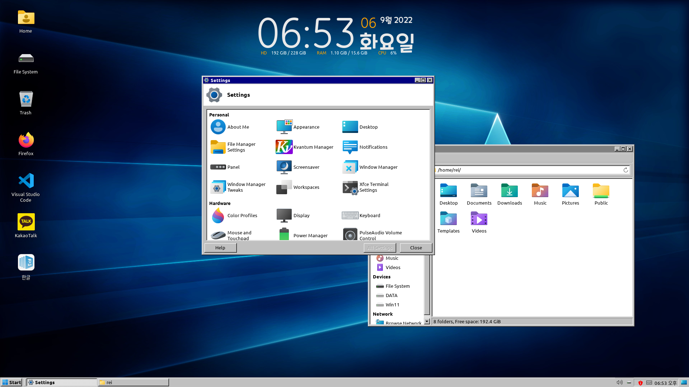

# Cobalt-icons

Windows 11 Style icons for Linux

## Based on

* [!Fluent-icon-theme by vinceliuice](https://github.com/vinceliuice/Fluent-icon-theme)

## Preview

## Screenshot

* KDE Plasma

* Xfce

